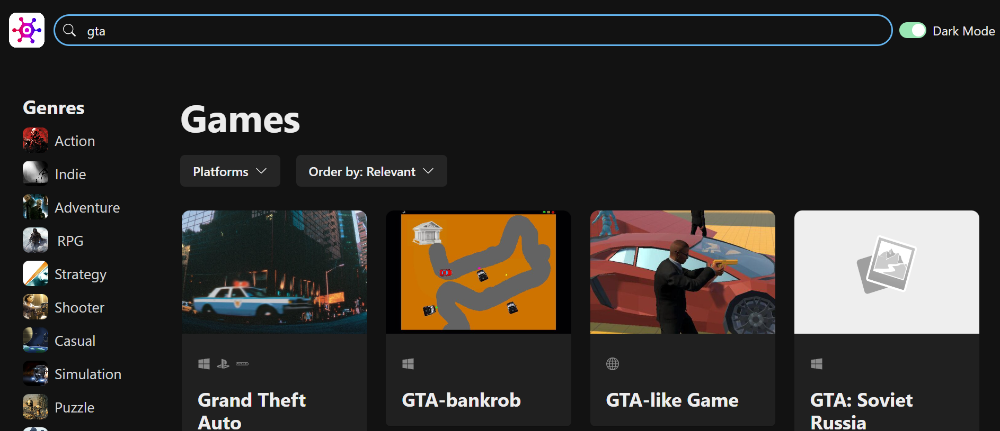

# Game Hub
Welcome to my personal Game Hub - a fully responsive web app for displaying online games.
## Demo

You can view my demo here: https://game-hub-psi-beryl.vercel.app
## Features:
- Responsive web interface for displaying games fetch from only resources without direct data storage.
- Data caching for more efficient user experience.
- Advanced game filtering and searching options without reloading entire page.
- Customizable dark/light theme.
- Detailed page for viewing single game.
- Skeleton loading for different app components and infinite scrolling.

## Screenshots:

*Main page*

*Searching*

*Filtering*

*Detail page*

*Responsive index page*

*Responsive detail page*

